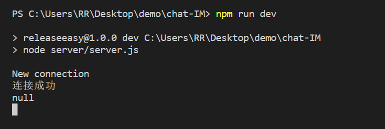
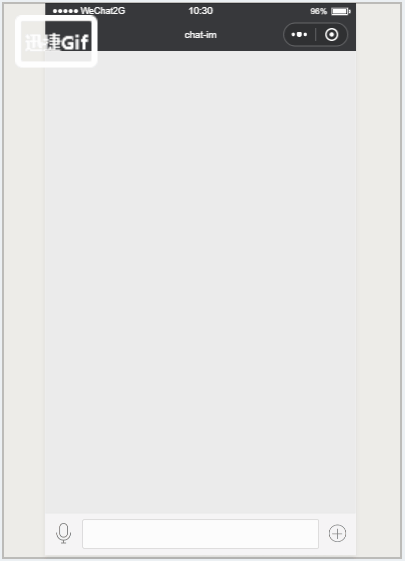

## chat-IM 
小程序即时通讯demo <a href="https://juejin.im/post/5bb03203e51d450e5162a38a">block link</a>
## 下载包 
nodejs-websocket   `npm install`

## 运行 
websocket server   `npm run dev`

如下图 服务开启 

## 功能
1. 发送图片（图片可点击放大）
2. 发送拍摄照片 （图片可点击放大）
3. 发送位置 （map组件默认在最顶层，样式控制不了，bug还在修复中...）
4. 发送语音 （包括语音时长，可点击播放）

