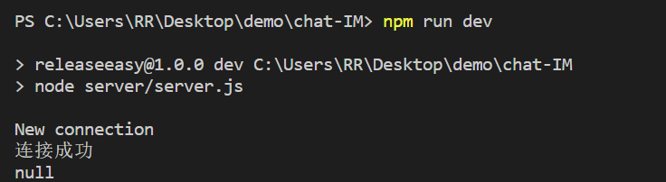
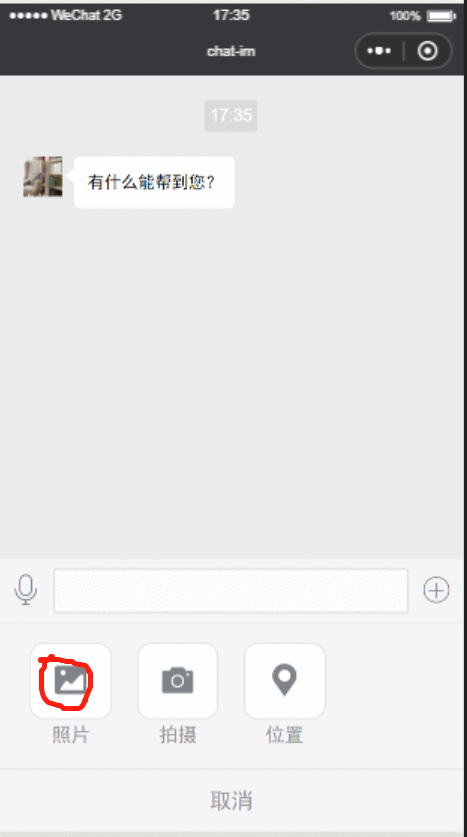
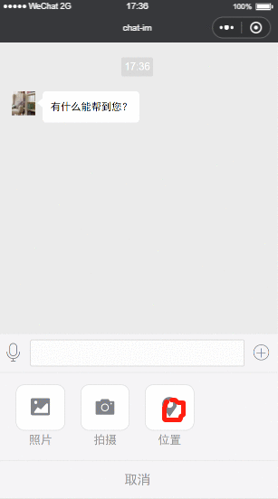

### 先下载包 
#### nodejs-websocket
`npm install`

### 运行websocket server
`npm run dev`

### 功能
#### 发送图片（图片可点击放大）
#### 发送拍摄照片 （图片可点击放大）
#### 发送位置 （map组件默认在最顶层，样式控制不了，bug还在修复中...）
#### 发送语音 （包括语音时长，可点击播放）

如下图 服务开启

